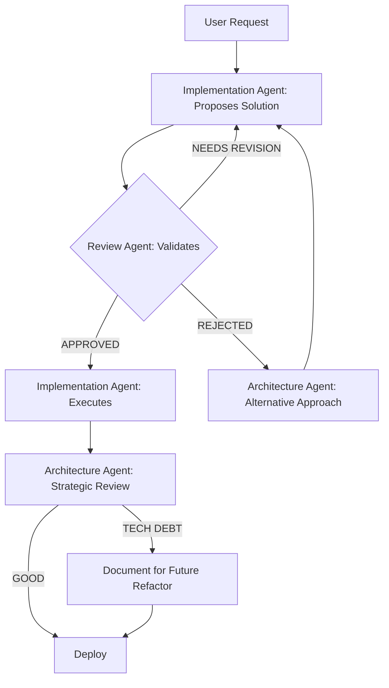

# Light Engine Foxtrot: AI Agent Skills Framework

**Version**: 1.2.0  
**Date**: January 31, 2026  
**Last Updated**: January 31, 2026 (Critical update: Investigation-First enforcement)  
**Purpose**: Strategic guidance for AI agents contributing to Light Engine development  
**Authority**: This document supersedes generic coding advice when conflicts arise

---

## 🚨 CRITICAL: Investigation-First Methodology (NON-NEGOTIABLE)

**Real Incident #1 (January 31, 2026 - Morning):**
Agent created comprehensive AI integration proposal without reviewing existing codebase. Result:
- Proposed rebuilding VPD controller (already exists, 405 lines)
- Proposed SARIMAX forecasting (already exists, line 11509)
- Proposed anomaly detection (already exists, IsolationForest)
- Proposed lot tracking (already exists, FDA-compliant)
- **Cost**: 2 hours wasted, user frustration, framework credibility damaged

**Real Incident #2 (January 31, 2026 - Afternoon):**
Agent implemented zone data display fix without investigation or multi-agent review. Result:
- Added inline field fallbacks (`z.id || z.zone_id || z.zoneId`) in 8 locations
- Violated DATA_FORMAT_STANDARDS.md requirement to use `lib/data-adapters.js`
- Never checked if `normalizeZone()` adapter already existed (it does)
- Never grepped codebase for adapter usage pattern
- Skipped multi-agent review process entirely (no proposal, no validation)
- Implemented directly without Review Agent or Architecture Agent approval
- **Cost**: Framework violation, technical debt, pattern inconsistency across codebase
- **Root Cause**: Rushed to "fix" without reading framework rules or investigating existing patterns
- **Resolution (January 31, 2026)**: 
  - Proper Investigation-First process followed on second attempt
  - Inline normalization functions added following farm-summary.html pattern (15-min investigation)
  - Multi-agent review completed (Implementation → Review → Approval)
  - Documented as technical debt for future build system migration
  - Review Agent approved pragmatic solution given HTML `<script>` limitations
  - Changes: central-admin.js (normalization functions), SCHEMA_CONSUMERS.md (registry update)
  - Framework compliance achieved through proper process

**Real Incident #3 (January 31, 2026 - Evening):**
Agent fixed Anomaly Detection Dashboard without multi-agent review. Result:
- Conducted Investigation-First correctly (traced weather API, found Python path issue)
- Identified root cause (ML errors displayed as anomalies, not actual anomaly detections)
- Implemented 3-file fix (admin.js, central-admin.js, ml-job-runner.js)
- **SKIPPED ENTIRE MULTI-AGENT REVIEW PROCESS**
- Committed and deployed to production without Review Agent validation
- No proposal submitted, no validation requested, no approval obtained
- **DEPLOYED WITHOUT TESTING** - Changed Python path but never verified ML script runs
- **Cost**: Framework violation, deployment without review, **PARTIAL FIX ONLY** (UX improved but ML still broken)
- **Root Cause**: "Saw clear fix" → Jumped to implementation → Forgot framework requires review
- **Why It Happened**: 
  - Investigation revealed obvious solution (filter error states in API)
  - Felt "simple fix" didn't need review (WRONG - all changes need review)
  - Urgency to deploy fix overrode framework discipline
  - **Assumed fix worked without verification** (changed `venv/bin/python` to `python3`)
- **What Was Actually Fixed**:
  - ✅ Dashboard UX (filters ML errors, shows "ML offline" vs "No anomalies")
  - ✅ Admin API (filters error states from anomaly list)
  - ❌ ML anomaly detection (still crashes - dependency errors in python3 environment)
- **Testing Revealed**: `python3 scripts/simple-anomaly-detector.py` fails with `requests` → `urllib3` → `http.client` import errors
- **How To Avoid**:
  1. **ALWAYS submit proposal** - even for "obvious" fixes
  2. **Template**: "Problem → Root Cause → Proposed Solution → @ReviewAgent validate"
  3. **Never skip because "it's simple"** - Review catches issues implementation misses
  4. **TEST before deploying** - Run the actual code path, don't assume changes work
  5. **Deployment gate**: Changes merged = Must have review approval in commit message
  6. **Mental checkpoint**: Before typing code changes, ask "Have I requested review?"
- **What Should Have Happened**:
  ```
  Implementation Agent: Submit proposal with investigation findings
  @ReviewAgent: Validate error filtering logic, dashboard UX, Python path fix
  Review Agent: "Did you test the ML script runs with python3?"
  Implementation Agent: Test reveals dependency errors, revise proposal
  @ReviewAgent: Approve revised solution (fix dependencies OR document ML as degraded)
  Implementation Agent: Implement approved changes with test verification
  Deploy: With "Review Agent approved" in commit
  ```
- **Resolution**: Post-deployment testing revealed partial fix, framework updated with violation + testing lesson
- **Framework Improvement**: Add explicit "Multi-Agent Review Checklist" + "Test Verification Requirement" before any implementation

### The Iron Law

**BEFORE proposing ANY solution, you MUST:**

1. **Read the Framework** (this document)
   - [ ] Core philosophy (Simplicity, Database-Driven, Workflow-Centric)
   - [ ] Data format standards
   - [ ] Multi-agent collaboration model

2. **Investigate the Codebase**
   ```bash
   # Required searches BEFORE proposing:
   
   # 1. Does this feature already exist?
   grep -r "feature_keyword" **/*.js
   
   # 2. What files handle this domain?
   find . -name "*feature*.js"
   
   # 3. What's the current implementation?
   # READ the files you found (don't just scan)
   
   # 4. What data structures are involved?
   cat public/data/*.json | jq 'keys'
   
   # 5. Are there existing APIs?
   grep "app.get\|app.post" server-foxtrot.js | grep feature
   ```

3. **Document What Exists**
   ```markdown
   ## Existing Implementation
   - File: automation/controllers/vpd-controller.js (405 lines)
   - Features: Hysteresis, duty cycle management, psychrometrics
   - Gap: Doesn't adapt to outdoor conditions
   - Opportunity: Add weather API integration (don't rebuild)
   ```

4. **ONLY THEN** Propose Enhancements
   ```markdown
   ## Proposal: Adaptive VPD Control
   
   ### Leverage (What Exists):
   - ✅ VPD controller with dynamic band support
   - ✅ outdoor-sensor-validator.js
   - ✅ Psychrometric calculations
   
   ### Add (What's Missing):
   - Weather API integration (OpenWeather)
   - AI adapter layer: Recipe → Weather Adjustment → VPD Controller
   - 50 lines of code (not 500)
   
   ### Result:
   - Enhance existing system (don't rebuild)
   - Minimal changes (low risk)
   - Leverage framework (database-driven)
   ```

### Consequences of Skipping Investigation

**Time Lost:**
- Agent: 1-2 hours creating redundant proposal
- User: 30 minutes reviewing/correcting
- Iteration: Additional hour for proper investigation
- **Total**: 3-4 hours per incident

**Trust Damage:**
- User questions agent competence
- Framework credibility undermined
- Future proposals treated with skepticism

**Opportunity Cost:**
- Could have implemented actual gap in same time
- Delays real improvements
- User frustration increases

### Verification Checklist (Use This EVERY Time)

**Before writing ANY proposal:**

```markdown
## Pre-Proposal Investigation Checklist

- [ ] Read Agent Skills Framework sections relevant to task
- [ ] Searched codebase for existing implementations
- [ ] Read (not just scanned) relevant source files
- [ ] Checked public/data/*.json for related data structures
- [ ] Grepped server-foxtrot.js for related API endpoints
- [ ] Reviewed automation/ directory for control logic
- [ ] Listed what EXISTS (with file paths and line numbers)
- [ ] Listed what's MISSING (actual gaps)
- [ ] Identified OPPORTUNITIES (enhance existing, don't rebuild)
- [ ] Confirmed proposal aligns with framework principles

Investigation completed: [DATE]
Time spent investigating: [X minutes]
Agent: [Your designation]
```

### When Investigation Shows "Already Exists"

**DO:**
```markdown
✅ "Investigated VPD control. Found sophisticated implementation
at automation/controllers/vpd-controller.js (405 lines).

Existing: Hysteresis, duty cycle caps, psychrometrics
Gap: No outdoor weather adaptation

Proposal: Add weather API integration (50 lines)
Leverage: Existing controller accepts dynamic bands"
```

**DON'T:**
```markdown
❌ "We should build a VPD controller with hysteresis..."
(DIDN'T CHECK - ALREADY EXISTS!)

❌ "Zone data not displaying, adding inline fallbacks..."
(DIDN'T CHECK - data-adapters.js ALREADY EXISTS!)

❌ "Fixed the bug" (WITHOUT checking framework rules on adapters)
```

### What To Do When You Realize You Violated Framework

**STOP IMMEDIATELY. Do NOT continue implementing.**

1. **Acknowledge the specific violations:**
   - Which rules were broken (Investigation-First, Data Adapters, Multi-Agent Review)
   - What should have been done instead
   - No excuses or justifications

2. **Ask for direction:**
   - Should changes be reverted?
   - Should proper investigation/proposal process start now?
   - Wait for user guidance before proceeding

3. **Do NOT try to "fix" violations with more changes** - that compounds the problem

### Emergency Override (Rare)

Only skip investigation if:
1. **Production down** (not "user wants feature fast")
2. **Data loss imminent** (not "data might be inconsistent")
3. **Security breach active** (not "potential vulnerability")

Even then: Document what investigation was skipped and commit to do it post-emergency.

---

## 🎯 Project Mission & Core Philosophy

### What We're Building

**Light Engine** is a comprehensive indoor farming platform that makes controlled environment agriculture accessible to anyone—from community organizations to commercial operations—by eliminating complexity through intelligent automation and database-driven standardization.

**Core Value Proposition:**
> **"You choose what to grow. We handle the rest."**

No programming. No guesswork. No spreadsheets. Just select a crop, and Light Engine automatically configures:
- Environmental controls (temperature, humidity, VPD)
- Dynamic lighting (spectrum, intensity, photoperiod)
- Inventory tracking (seed-to-sale, zero data entry)
- Sales channels (POS, online store, wholesale marketplace)

### Why This Exists

**Problem**: Traditional CEA operations are too complex—require expensive consultants, constant manual adjustments, and extensive agricultural expertise.

**Solution**: Research-validated automation guided by 60+ database-driven crop recipes, refined across thousands of grow cycles. Professional results from day one.

---

## 🏗️ System Architecture (Critical Understanding)

### Two-Tier Deployment Model

```
┌─────────────────────────────────────────────────────────────┐
│                    GREENREACH CENTRAL                        │
│              (Cloud - greenreachgreens.com)                  │
│                                                              │
│  • PostgreSQL database (multi-tenant)                        │
│  • Wholesale marketplace (multi-farm ordering)               │
│  • Central admin dashboard (monitor all farms)               │
│  • Buyer portal (restaurants, grocers)                       │
│  • Payment processing (Stripe, Square)                       │
│  • Automated farm provisioning                               │
│                                                              │
│  Syncs with Edge Devices every 5 minutes ↓                  │
└─────────────────────────────────────────────────────────────┘
                             ↕
                    Secure mTLS Connection
                             ↕
┌─────────────────────────────────────────────────────────────┐
│                      EDGE DEVICE                             │
│        (reTerminal @ farm - 100.65.187.59)                   │
│                                                              │
│  • Light Engine Node.js (server-foxtrot.js)                  │
│  • Local farm dashboard (farm-summary.html, etc.)            │
│  • Real-time environmental control                           │
│  • IoT device management (lights, sensors, HVAC)             │
│  • Local inventory tracking                                  │
│  • Offline-first operation (syncs when online)               │
│                                                              │
│  Controls Farm Equipment ↓                                   │
└─────────────────────────────────────────────────────────────┘
                             ↓
              ┌──────────────────────────────┐
              │  FARM DEVICES                │
              │  • DMX512 Lighting           │
              │  • Environmental Sensors     │
              │  • HVAC Controls             │
              │  • Smart Plugs               │
              └──────────────────────────────┘
```

**Agent Understanding Check:**
- ✅ Edge devices run autonomously (offline-capable)
- ✅ Central aggregates data from multiple farms
- ✅ Wholesale marketplace connects buyers to multi-farm inventory
- ✅ Sync is bidirectional but edge is source of truth for farm data
- ✅ Authentication is multi-tenant (farm-based isolation)

---

## 🎓 Core Programming Themes (MUST INTERNALIZE)

### 1. **Simplicity Over Features**

**Rule**: Every feature must reduce grower workload, not add steps.

```javascript
// ❌ BAD: Requires grower to understand technical parameters
function setLightingSchedule(ppfd, spectrum, photoperiod, rampUp, rampDown) {
  // Complex interface requiring expertise
}

// ✅ GOOD: Grower selects outcome, system handles details
function selectCrop(cropName) {
  const recipe = recipesDB.get(cropName); // Database-driven
  applyRecipe(recipe); // Handles all parameters automatically
}
```

**Agent Principle:**
- **Before adding UI**: Ask "Can this be automated based on crop selection?"
- **Before adding config**: Ask "Can this be database-driven from recipes?"
- **Before adding workflow steps**: Ask "Can this happen in the background?"

### 2. **Database-Driven Everything**

**Rule**: Configuration is data, not code. Recipes, schedules, and settings live in databases/JSON, not hardcoded.

**Current Database Assets:**
```
/public/data/
├── lighting-recipes.json       # 60+ crop recipes (1.3MB)
├── groups.json                 # Active plantings
├── farm.json                   # Farm profile
├── rooms.json                  # Farm layout
├── automation-rules.json       # Environmental triggers
└── crop-catalog.json           # Available crops
```

**Agent Pattern:**
```javascript
// ✅ Correct: Load from database/JSON
const recipe = JSON.parse(fs.readFileSync('public/data/lighting-recipes.json'));
const buttercrunch = recipe.crops.find(c => c.name === 'Buttercrunch Lettuce');

// ❌ Wrong: Hardcoded configuration
const buttercrunch = {
  ppfd: 300,
  photoperiod: 16,
  spectrum: { red: 70, blue: 30 }
}; // This should be in database!
```

**Why This Matters:**
- Growers can customize recipes without code changes
- Research updates propagate via data files, not software updates
- Multi-tenant: Each farm can have custom recipe library

### 3. **Workflow-Centric UI Design**

**Rule**: UI follows actual farm workflows, not software architecture.

**Real Grower Workflow** (Activity Hub Model):
```
Morning:
  1. Check environmental alerts
  2. Review harvest forecast (what's ready today + next 7 days)
  3. Scan trays during watering (updates inventory automatically)
  
Midday:
  4. Process wholesale orders (pick, pack, scan QR for lot tracking)
  5. Check lighting schedule (system handles, but visibility is reassuring)
  
Evening:
  6. Record harvest quantities (scan tray QR → auto-creates sellable lot)
  7. Review tomorrow's tasks (planting schedule, order fulfillment)
```

**Agent Principle:**
- **Don't design by entity**: "Device Manager" → "Group Manager" → "Schedule Manager" (too technical)
- **Design by task**: "Morning Checklist" → "Order Fulfillment" → "Harvest Recording" (matches workflow)
- **Progressive disclosure**: Show next action prominently, hide complexity

### 4. **Automation with Visibility**

**Rule**: Systems should run autonomously, but growers must see what's happening (trust through transparency).

```javascript
// ✅ Automation Example: Dynamic Lighting
// System automatically adjusts, but UI shows:
// - Current PPFD vs target
// - Why intensity changed (growth stage transition)
// - Energy saved today vs static schedule
// - Override available (but rarely needed)

automationEngine.on('schedule-change', (event) => {
  logToUI(`Adjusted ${event.device} to ${event.newIntensity}% (crop entered ${event.growthStage})`);
  notifyIfCritical(event);
});
```

**Agent Pattern for New Automation:**
1. Implement automation logic
2. Add visibility dashboard widget
3. Log significant actions to activity feed
4. Provide override mechanism (but hide in "advanced" section)
5. Track override usage (if growers override often, automation needs improvement)

### 5. **Zero-Entry Data Capture**

**Rule**: Inventory, harvest, and sales data should update automatically through work growers are already doing.

**QR Code Pattern** (Gold Standard):
```
Tray QR Code: TRY-00142
  
Scan Context                     System Action
────────────────────────────────────────────────────────────
Seeding station                  → Create tray, record seed date, crop
Transplant area                  → Update location, growth stage
Watering (daily)                 → Log water event, visual health check
Harvest                          → Create sellable lot, reduce growing inventory
Point of sale                    → Record sale, update available inventory, generate receipt

Result: Complete seed-to-sale traceability without spreadsheets
```

**Agent Implementation:**
- Use QR scans as event triggers
- Infer intent from scan location/context
- Update all relevant systems in background
- Provide visual feedback ("Tray TRY-00142 harvested, 2.4 lbs added to available inventory")

---

## 🌐 GreenReach Ecosystem (Key Concepts)

### GreenReach Central

**Purpose**: Multi-tenant cloud platform connecting farms, buyers, and community organizations.

**Key Services:**
1. **Wholesale Marketplace**: 
   - Multi-farm catalog aggregation
   - Buyers order from multiple farms in one checkout
   - Intelligent alternative sourcing (99% fulfillment guarantee)
   - Auto-splits orders to farms
   
2. **Central Admin Dashboard**:
   - Monitor all farms in network
   - Aggregate inventory across farms
   - Anomaly detection (predict equipment failures)
   - Business intelligence (demand forecasting)

3. **Farm Provisioning**:
   - Automated account creation after purchase
   - Pre-configured farm profiles
   - Demo data for evaluation

**Agent Understanding:**
- Central is NOT optional—it's the backbone of the ecosystem
- Edge devices push inventory every 5 minutes (API: `/api/sync/inventory`)
- Buyers never interact with edge devices directly (only Central)
- Multi-tenant: Farms are isolated, buyers see aggregated catalog

### GreenReach Wholesale

**Business Model**: Connect boutique farms directly to commercial buyers (restaurants, grocers, institutions).

**How It Works:**
```
1. Farm grows crops using Light Engine
2. Inventory automatically syncs to Central every 5 minutes
3. Central publishes to wholesale marketplace
4. Buyer browses unified catalog, adds items from multiple farms
5. Central splits order by farm (Order #123 → Farm A: $50, Farm B: $80)
6. Each farm receives notification (24h to verify)
7. Farm accepts/declines via dashboard
8. If declined, Central auto-finds alternative farm
9. Coordinated fulfillment (buyer picks up from all farms or central hub)
10. Payment processed, farms paid weekly (70-90% retail value)
```

**Why This Matters for Agents:**
- Inventory accuracy is CRITICAL (buyers pre-pay, expect fulfillment)
- Real-time sync is non-negotiable (5-minute intervals)
- Order verification workflow must be simple (one-click accept)
- Alternative sourcing algorithm depends on accurate categorization (SKUs, certifications)

### Target Users (Know Your Audience)

**Primary Users:**
1. **Community Organizations** (50% of users)
   - Food banks, churches, schools
   - Volunteer-run, minimal ag experience
   - Need: Simplest possible operation, visual workflows
   
2. **Boutique Commercial Farms** (30%)
   - 500-5,000 sq ft operations
   - 1-3 full-time staff
   - Need: Professional automation, wholesale access
   
3. **Research Institutions** (10%)
   - Universities, ag research centers
   - Testing new varieties, protocols
   - Need: Detailed data logging, experiment tracking
   
4. **Enterprise CEA** (10%)
   - 10,000+ sq ft warehouses
   - Dedicated tech staff
   - Need: Multi-room coordination, advanced analytics

**Agent Implication:**
- **Default UI = Community Org Mode** (visual, non-technical)
- **Advanced features hidden** (accessible via "Research Mode" toggle)
- **Terminology matters**: "Crop" not "cultivar", "Tray" not "germination vessel"
- **Tooltips everywhere**: Never assume agricultural knowledge

---

## 🛠️ Technical Standards (NON-NEGOTIABLE)

### Data Format Governance ⚠️ CRITICAL

**Problem**: Agents have been modifying source data formats to fix individual pages, breaking 56+ consumers.

**Solution**: Canonical format standards with validation.

**BEFORE touching groups.json, farm.json, or rooms.json:**

```bash
# 1. Read standards
cat DATA_FORMAT_STANDARDS.md

# 2. Check consumers (56+ locations depend on these)
cat SCHEMA_CONSUMERS.md

# 3. Validate current state
npm run validate-schemas

# 4. If format looks wrong, FIX CONSUMER, not source data
```

**Adapter Pattern (ALWAYS USE):**
```javascript
// ✅ CORRECT: Use adapters for format variations
import { normalizeGroup, toDisplayFormat } from './lib/data-adapters.js';

const rawGroups = JSON.parse(fs.readFileSync('public/data/groups.json'));
const groups = rawGroups.groups.map(normalizeGroup); // Handles crop/recipe, roomId/room, etc.
const display = groups.map(toDisplayFormat); // UI-friendly format

// ❌ WRONG: Modifying source data to match consumer expectation
rawGroups.groups[0].recipeName = rawGroups.groups[0].crop; // BREAKS 56 CONSUMERS!
fs.writeFileSync('groups.json', JSON.stringify(rawGroups));
```

**Agent Response Template:**
```
❌ Cannot modify groups.json format to add [FIELD].

REASON: 56+ consumers depend on this canonical format.

SOLUTION:
1. Use existing field: group.crop (not group.recipe)
2. Add adapter: normalizeGroup(group) from lib/data-adapters.js
3. Add fallback: group.crop || group.recipe

See DATA_FORMAT_STANDARDS.md for details.
```

### Code Organization Principles

**File Structure** (MUST RESPECT):
```
Light-Engine-Foxtrot/
├── server-foxtrot.js              # Edge device server (main entry point)
├── greenreach-central/
│   ├── server.js                  # Central cloud server
│   ├── routes/                    # Central API routes
│   └── public/                    # Central UI (admin, wholesale)
├── public/
│   ├── data/                      # Canonical data files (groups, farm, etc.)
│   ├── views/                     # Farm dashboard pages
│   └── LE-farm-admin.html         # Main farm interface
├── lib/
│   ├── data-adapters.js           # Format normalization
│   ├── schema-validator.js        # JSON schema validation
│   └── schedule-executor.js       # Automation engine
├── routes/
│   ├── admin-farm-management.js   # Farm CRUD APIs
│   ├── wholesale-sync.js          # Inventory sync to Central
│   └── setup-wizard.js            # First-run wizard
└── services/
    ├── wholesale-integration.js   # Central sync service
    └── mqtt-handler.js            # IoT device communication
```

**Agent Rule:**
- **Edge code** (server-foxtrot.js, routes/) = farm-specific, offline-capable
- **Central code** (greenreach-central/) = multi-tenant, always-online
- **Shared libraries** (lib/) = used by both Edge and Central

### Testing Requirements

**Before Committing:**
```bash
# 1. Validate data schemas
npm run validate-schemas

# 2. Run smoke tests
npm run smoke

# 3. Check for errors
npm run test

# 4. Edge device acceptance test (if available)
npm run test:edge
```

**Agent Checklist:**
- [ ] Does this change affect data formats? → Run `validate-schemas`
- [ ] Does this add new API endpoint? → Add to smoke test
- [ ] Does this touch wholesale sync? → Test with `test:wholesale`
- [ ] Does this change authentication? → Verify multi-tenant isolation
- [ ] Can this run offline? → Test with `OFFLINE_MODE=true`

---

## 🤝 Multi-Agent Collaboration Model

### Problem Statement

Single-agent development leads to:
- **Scope creep**: One agent tries to solve everything, loses focus
- **Insufficient validation**: No peer review before implementation
- **Conflicting approaches**: Different agents apply incompatible patterns
- **Rework cycles**: Incorrect implementations require complete rewrites
- **Hallucinations**: Agents invent features/APIs that don't exist
- **Mission drift**: Solutions that don't align with project goals

### Solution: Structured Multi-Agent Review

**Multi-agent review is REQUIRED for risk reduction. Single-agent implementation is prohibited for:**
- Data format changes affecting 5+ consumers
- Authentication/security modifications
- Database schema changes
- Recipe optimization algorithms
- Cross-farm data aggregation
- API contract changes
- Automation rule modifications

**Three-Agent Minimum:**
1. **Implementation Agent** (PRIMARY)
2. **Review Agent** (VALIDATOR)
3. **Architecture Agent** (STRATEGIST)

**Each agent operates in a separate session/context to ensure true independence.**

---

### Agent Role Definitions

#### 1. Implementation Agent (PRIMARY)
GUARDRAILS (Mandatory):**

**1. Scope Limitation**
```markdown
ONLY implement what was explicitly requested.

✅ ALLOWED:
- Exact task as stated in user request
- Bug fixes directly blocking the task
- Required dependencies for the task

❌ PROHIBITED without approval:
- "While I'm here" improvements
- Related features not requested
- Refactoring unrelated code
- Optimization of adjacent systems
- Documentation updates beyond scope

If you identify related improvements:
→ List as "Recommendations" in proposal
→ Require explicit approval before implementing
```

**2. Hallucination Prevention**
```markdown
BEFORE proposing any solution:

- [ ] Verify API endpoint exists (grep codebase)
- [ ] Verify file path exists (list_dir, file_search)
- [ ] Verify function/class exists (grep_search)
- [ ] Verify data format in actual files (read_file)
- [ ] Verify dependencies in package.json
- [ ] Test commands with terminal before documenting
**Challenge assumptions and verify claims**
- Approve or reject with specific feedback

**CRITICAL ROLE**: Review Agent is the **skeptic** - question everything, assume nothing.

**Validation Checklist:**
```markdown
## Review Checklist

### Scope Adherence (CRITICAL)
- [ ] Solution addresses ONLY the requested task
- [ ] No scope creep detected ("while I'm here" additions)
- [ ] Related improvements properly flagged as recommendations
- [ ] Justification provided for any scope expansion

**RED FLAGS - Auto-Reject if Present:**
- "I also improved..." ❌
- "While I was there, I refactored..." ❌
- "I took the liberty of..." ❌
- "Additionally, I optimized..." ❌

### Hallucination Detection (CRITICAL)
- [ ] All file paths verified to exist
- [ ] All API endpoints confirmed in codebase
- [ ] All functions/classes confirmed to exist
- [ ] All data formats match actual files
- [ ] No assumed "standard" libraries/features
- [ ] All code examples are real (not invented)

**VERIFICATION REQUIRED:**
```bash
# Agent MUST provide evidence:
grep -r "proposed_function_name" .
ls -la path/to/proposed/file.js
cat public/data/groups.json | head -20
```

**If Implementation Agent says "probably exists" → REJECT immediately**

### Solution Validity
- [ ] Solution actually solves the stated problem
- [ ] Solution doesn't introduce new problems
- [ ] Solution is minimal (not over-engineered)
- [ ] Alternative approaches considered and documented

**Challenge Questions to Ask:**
1. "Why this approach vs simpler alternative X?"
2. "What evidence confirms this API exists?"
3. "How does this align with 'simplicity over features'?"
4. "What's the blast radius if this fails?"
5. "Can you show me this pattern used elsewhere?"

### Framework Compliance
- [ ] Reduces grower workload (not adds steps)
- [ ] Database-driven (not hardcoded)
- [ ] Workflow-centric UI (not entity-based)
- [ ] Automation with visibility
- **Challenge solutions that don't align with project goals**
- **Identify when simple problems get complex solutions**

**CRITICAL ROLE**: Architecture Agent is the **pragmatist** - protect long-term vision, prevent complexity creep.

**Strategic Review:**
```markdown
## Architecture Assessment

### Mission Alignment Verification
**Question 1: Does this reduce grower workload?**
- Current grower workflow: [Describe]
- After implementation: [Describe]
- Net result: [Simpler / Same / More complex]

**If "More complex" → REJECT immediately**

**Question 2: Is this the simplest solution?**
- Proposed solution: [Complexity score: 1-10]
- Simpler alternative 1: [Score + why not chosen]
- Simpler alternative 2: [Score + why not chosen]

**If simpler alternatives exist → Request justification or REJECT**

**Question 3: Does this align with core philosophy?**
- [ ] Database-driven (not code-driven)
- [ ] Automation (not manual process)
- [ ] Standardization (not customization)
- [ ] Workflow-centric (not entity-centric)
B1{Scope Check}
    B1 -->|Scope Creep Detected| B2[Remove Out-of-Scope Items]
    B2 --> B
    B1 -->|Scope Valid| C[Review Agent: Validates]
    C --> C1{Hallucination Check}
    C1 -->|Unverified Claims| C2[REJECT: Provide Evidence]
    C2 --> B
    C1 -->|All Verified| C3{Framework Compliance}
    C3 -->|FAIL| C4[REJECT: List Violations]
    C4 --> B
    C3 -->|PASS| D{Verdict}
    D -->|APPROVED| E[Architecture Agent: Strategic Review]
    D -->|NEEDS REVISION| B
    D -->|REJECTED| F[Architecture Agent: Alternative Approach]
    F --> B
    E --> E1{Mission Alignment}
    E1 -->|Misaligned| E2[REJECT: Explain Why]
    E2 --> F
    E1 -->|Aligned| E3{Simplicity Check}
    E3 -->|Too Complex| E4[REJECT: Simplify]
    E4 --> B
    E3 -->|Acceptable| G{Final Verdict}
    G -->|PROCEED| H[Implementation Agent: Execute]
    G -->|DEFER| I[Document as Future Work]
    G -->|REJECT| F
    H --> J[Validation Tests]
    J -->|FAIL| K[Review Agent: Analyze Failure]
    K --> B
    J -->|PASS| L[Deploy]
    G -->|TECH DEBT| M[Document Debt + Deploy]
    M --> L
```

**Key Decision Points:**

1. **Scope Check** (Auto-gate): Proposal must address only requested task
2. **Hallucination Check** (Hard gate): All claims must have evidence
3. **Framework Compliance** (Hard gate): Must follow all standards
4. **Mission Alignment** (Hard gate): Must reduce complexity, not add
5. **Simplicity Check** (Judgment call): Simpler alternatives evaluated
6. **Validation Tests** (Post-implementation): Verify before deployED FLAGS - Reject if present:**
- "This will be useful later..." ❌
- "We might need this for..." ❌
- "This makes it more flexible..." ❌ (unless flexibility requested)
- "This is more enterprise-ready..." ❌ (not the goal)

### Complexity Analysis
**Cyclomatic Complexity**:
- Functions added: [Count]
- Conditional branches: [Count]
- External dependencies: [Count]

**Maintainability Score**: [1-10, where 10 = easily understood by new dev]

**If score < 6 → Simplification required**

### Long-term Implications
- Reusability: [Can other features build on this?]
- Maintainability: [Can junior dev understand this in 6 months?]
- Scalability: [Works for 1 farm and 1000 farms?]

### Technical Debt
- Shortcuts taken: [List with justification]
- Refactoring recommended: [None/Describe]
- Framework updates needed: [None/Describe]

### Scale Test
**Will this work at:**
- [ ] 1 farm (MVP)
- [ ] 10 farms (beta)
- [ ] 100 farms (launch)
- [ ] 1,000 farms (scale)

**If fails at any level → Redesign required**
| **Scope adherence** | Stays within requested task | >95% |
| **Hallucination rate** | Invented APIs/features proposed | <2% |
| **Mission alignment** | Solutions match project goals | >90% |

### Cost/Benefit Analysis
**Implementation Cost**: [Hours/Days]
**Maintenance Cost**: [Hours/month]
**Value Delivered**: [Tangible benefit to growers]

**If cost > value → DEFER or REJECT**

**Recommendation**: [PROCEED / REVISE / DEFER / REJECT]

| Scope Adherence | 6/10 | ⚠️ Added 3 unrelated improvements without approval |
| Hallucination Rate | 9/10 | 1 instance of assumed API (corrected in review) |
| Mission Alignment | 8/10 | Good, but one over-engineered solution |

**Strengths**:
- Excellent documentation
- Follows patterns consistently
- Good at workflow-centric design

**Areas for Improvement**:
- Data format standards (needed 1 correction)
- Multi-tenant edge cases (missed isolation check)
- Scope control (added features not requested)
- Verification rigor (assumed API existed without checking)

**Violations Log**:
- Week 2: Modified groups.json without adapter (CRITICAL)
- Week 3: Added dashboard widget not requested (SCOPE CREEP)
- Week 4: Proposed API that didn't exist (HALLUCINATION)

**Recommendation**: 
- PRIMARY agent for feature development with **scope monitoring**
- VALIDATOR for data changes with **verification checklist**
- NOT RECOMMENDED for security features (needs verification improvement)
- [List each problem with evidence]
- [Include line numbers, file paths, grep results]

**Required Changes**:
1. [Concrete action required]
2. [Must be verifiable]

**Questions for Implementation Agent**:
- [Any unclear assumptions]
- [Request evidence for claims]
```

**Review Agent Authority:**
- Can REJECT proposals without Architecture Agent approval
- Can request verification evidence before proceeding
- Can require scope reduction
- Can demand proof that APIs/functions existiles to modify: [List with line numbers if known]
- Data format changes: [None/Describe]
- New dependencies: [None/List]
- Breaking changes: [None/Describe]

**Verification Performed**:
- [ ] Grepped codebase for existing implementations
- [ ] Verified file paths exist
- [ ] Checked similar patterns in project
- [ ] Reviewed DATA_FORMAT_STANDARDS.md
- [ ] Confirmed APIs/functions exist

**Impact Analysis**:
- Consumers affected: [Count, see SCHEMA_CONSUMERS.md]
- Offline compatibility: [Yes/No]
- Multi-tenant safe: [Yes/No]
- Blast radius: [What breaks if this fails]

**Alignment Check**:
- [ ] Reduces grower workload (not adds complexity)
- [ ] Follows database-driven approach
- [ ] Maintains workflow-centric design
- [ ] Solution is minimal (no over-engineering)

**Related Improvements (NOT implementing without approval)**:
- [List any "while I'm here" ideas]
- [Requires explicit approval to proceed]
- New dependencies: [None/List]
- Breaking changes: [None/Describe]

**Impact Analysis**:
- Consumers affected: [Count, see SCHEMA_CONSUMERS.md]
- Offline compatibility: [Yes/No]
- Multi-tenant safe: [Yes/No]

**Validation Required**:
- [ ] Schema validation passed
- [ ] Smoke tests passed
- [ ] Follows workflow-centric design
- [ ] Uses database-driven configuration

**Review Agent**: Please validate approach before implementation.
```

#### 2. Review Agent (VALIDATOR)

**Responsibilities:**
- Validate proposed solutions against framework
- Check for data format violations
- Verify workflow alignment
- Identify edge cases and failure modes
- Approve or reject with specific feedback

**Validation Checklist:**
```markdown
## Review Checklist

### Framework Compliance
- [ ] Reduces grower workload (not adds steps)
- [ ] Database-driven (not hardcoded)
- [ ] Workflow-centric UI (not entity-based)
- [ ] Automation with visibility
- [ ] Zero-entry data capture where possible

### Technical Standards
- [ ] Respects DATA_FORMAT_STANDARDS.md
- [ ] Uses adapters (lib/data-adapters.js) for format variations
- [ ] Validates with `npm run validate-schemas`
- [ ] Offline-compatible (if edge device feature)
- [ ] Multi-tenant safe (if central feature)

### Code Quality
- [ ] Follows existing file structure
- [ ] Includes error handling
- [ ] Logs significant actions
- [ ] Provides user feedback

### Documentation
- [ ] Updates SCHEMA_CONSUMERS.md if new consumer
- [ ] Documents API changes
- [ ] Includes inline comments for complex logic

**Verdict**: [APPROVED / NEEDS REVISION / REJECTED]

**Feedback**: [Specific issues to address]
```

#### 3. Architecture Agent (STRATEGIST)

**Responsibilities:**
- Evaluate alignment with long-term vision
- Identify technical debt risks
- Suggest refactoring opportunities
- Escalate pattern violations
- Maintain framework evolution

**Strategic Review:**
```markdown
## Architecture Assessment

**Alignment with Mission**:
- Does this advance "simplicity over features"? [Yes/No + Explanation]
- Is this the right abstraction layer? [Yes/No + Alternative]

**Long-term Implications**:
- Reusability: [Can other features build on this?]
- Maintainability: [Complexity score: Low/Medium/High]
- Scalability: [Works for 1 farm and 1000 farms?]

**Technical Debt**:
- Shortcuts taken: [List]
- Refactoring recommended: [None/Describe]
- Framework updates needed: [None/Describe]

**Recommendation**: [PROCEED / REVISE / DEFER]
```

---

### Collaboration Workflow



**Phase 1: Proposal**
```
USER: "Add harvest forecasting to dashboard"

IMPLEMENTATION AGENT:
┌─────────────────────────────────────┐
│ Proposal: Harvest Forecast Widget   │
├─────────────────────────────────────┤
│ • Reads: groups.json, rooms.json    │
│ • Calculates: Days to harvest       │
│ • UI: Card on farm-summary.html     │
│ • Data: Uses planConfig.seedDate    │
│ • Impact: No schema changes         │
└─────────────────────────────────────┘
@ReviewAgent Please validate approach.
```

**Phase 2: Validation**
```
REVIEW AGENT:
┌─────────────────────────────────────┐
│ ✅ Framework Compliance: PASS       │
├─────────────────────────────────────┤
│ ✅ Uses existing data (no mods)     │
│ ✅ Workflow-centric (dashboard)     │
│ ⚠️ Suggestion: Add ML forecast too  │
│ ✅ Technical Standards: PASS        │
│ ✅ Multi-tenant safe                │
└─────────────────────────────────────┘
APPROVED with suggestion to add ML integration hook.
@ImplementationAgent Proceed.
```

**Phase 3: Strategic Review**
```
ARCHITECTURE AGENT:
┌─────────────────────────────────────┐
│ Strategic Assessment                │
├─────────────────────────────────────┤
│ Alignment: HIGH (grower visibility) │
│ Reusability: Can power order system │
│ Complexity: LOW (read-only widget)  │
│ Tech Debt: None                     │
│ Future: Add buyer pre-order hook    │
└─────────────────────────────────────┘
APPROVED. Document forecast algorithm for future wholesale integration.
```

---

### Agent Performance Tracking

**Metrics to Track** (for agent selection optimization):

| Metric | Measurement | Target |
|--------|-------------|--------|
| **First-time accuracy** | Solutions correct without revision | >80% |
| **Framework compliance** | Passes review checklist | >95% |
| **Code quality** | Linter errors, test failures | <5 per PR |
| **Data format violations** | Schema validation failures | 0 |
| **Rework cycles** | Revisions required | <2 per feature |
| **Feature completeness** | Meets all requirements | 100% |
| **Documentation quality** | Inline comments, updates | >90% |

**Agent Scorecard Template:**
```markdown
## Agent: Claude Sonnet 4.5

**Period**: January 2026

| Category | Score | Notes |
|----------|-------|-------|
| Framework Compliance | 9/10 | Minor data format issue (week 2) |
| Code Quality | 10/10 | Clean, well-documented |
| First-time Accuracy | 7/10 | 3 revisions required (complex features) |
| Strategic Thinking | 8/10 | Good alignment, missed scalability concern |

**Strengths**:
- Excellent documentation
- Follows patterns consistently
- Good at workflow-centric design

**Areas for Improvement**:
- Data format standards (needed 1 correction)
- Multi-tenant edge cases (missed isolation check)

**Recommendation**: PRIMARY agent for feature development, VALIDATOR for data changes
```

---

## 🎯 Agent Selection Criteria

### Goal: Identify Top 2-3 Agents for This Project

**Evaluation Dimensions:**

1. **Architectural Understanding** (30%)
   - Grasps Edge/Central split
   - Understands offline-first design
   - Knows multi-tenant implications

2. **Domain Knowledge** (20%)
   - Agriculture/horticulture familiarity
   - Workflow-centric thinking
   - User empathy (non-technical growers)

3. **Technical Precision** (25%)
   - Respects data format standards
   - Writes clean, maintainable code
   - Error handling and edge cases

4. **Collaboration Quality** (15%)
   - Accepts feedback gracefully
   - Provides clear proposals
   - Documents changes thoroughly

5. **Strategic Thinking** (10%)
   - Long-term maintainability
   - Scalability considerations
   - Technical debt awareness

**Agent Types Needed:**

**Type A: Feature Implementer** (PRIMARY)
- Deep technical skills
- High framework compliance
- Fast execution
- Best for: New features, UI improvements, API endpoints

**Type B: Systems Architect** (VALIDATOR)
- Strategic thinking
- Data modeling expertise
- Pattern recognition
- Best for: Major refactors, schema changes, integration design

**Type C: Domain Specialist** (STRATEGIST)
- Agricultural knowledge
- User experience focus
- Workflow design
- Best for: UX improvements, grower-facing features, documentation

**Optimal Team**: 1x Type A (60% of work) + 1x Type B (30%) + 1x Type C (10%)

---

## 📚 VS Code Tools Integration

### Recommended Extensions for Light Engine Development

**Essential:**
1. **ESLint** - Code quality
   - Config: Use Airbnb style guide
   - Auto-fix on save
   
2. **Prettier** - Code formatting
   - Config: 2-space indent, single quotes, semicolons
   
3. **GitLens** - Git history
   - Track agent contributions
   - Blame for debugging

4. **Thunder Client** - API testing
   - Test edge device APIs (localhost:8091)
   - Test Central APIs (greenreachgreens.com)

**Development:**
5. **REST Client** - HTTP file testing
   - Save test suites in `/tests/http/`
   - Version control API tests

6. **Database Client** - PostgreSQL management
   - Connect to Central database
   - Query farm data directly

7. **Docker** - Container management
   - Run PostgreSQL locally
   - Test multi-tenant isolation

**Specialized:**
8. **PlantUML** - Architecture diagrams
   - Document workflows
   - Visualize data flows

9. **Markdown All in One** - Documentation
   - TOC generation
   - Preview rendering

10. **TODO Highlight** - Track tech debt
    - Mark `// TODO:` comments
    - Track refactoring needs

### VS Code Settings (Recommended)

```json
{
  "editor.formatOnSave": true,
  "editor.codeActionsOnSave": {
    "source.fixAll.eslint": true
  },
  "files.associations": {
    "*.html": "html",
    "*.json": "jsonc"
  },
  "files.exclude": {
    "**/node_modules": true,
    "**/.git": true,
    "**/dist": true
  },
  "search.exclude": {
    "**/node_modules": true,
    "**/dist": true,
    "**/.github": false
  },
  "eslint.validate": [
    "javascript",
    "javascriptreact"
  ],
  "editor.rulers": [80, 120],
  "workbench.colorTheme": "One Dark Pro",
  "terminal.integrated.fontSize": 13
}
```

### Task Automation (tasks.json)

```json
{
  "version": "2.0.0",
  "tasks": [
    {
      "label": "Validate Schemas",
      "type": "shell",
      "command": "npm run validate-schemas",
      "problemMatcher": []
    },
    {
      "label": "Smoke Test",
      "type": "shell",
      "command": "npm run smoke",
      "problemMatcher": []
    },
    {
      "label": "Start Edge Server",
      "type": "shell",
      "command": "PORT=8091 node server-foxtrot.js",
      "problemMatcher": [],
      "isBackground": true
    },
    {
      "label": "Start Central Server",
      "type": "shell",
      "command": "cd greenreach-central && PORT=3100 node server.js",
      "problemMatcher": [],
      "isBackground": true
    }
  ]
}
```

### Debugging Configuration (launch.json)

```json
{
  "version": "0.2.0",
  "configurations": [
    {
      "type": "node",
      "request": "launch",
      "name": "Debug Edge Server",
      "program": "${workspaceFolder}/server-foxtrot.js",
      "env": {
        "PORT": "8091",
        "NODE_ENV": "development",
        "DEBUG": "light-engine:*"
      }
    },
    {
      "type": "node",
      "request": "launch",
      "name": "Debug Central Server",
      "program": "${workspaceFolder}/greenreach-central/server.js",
      "env": {
        "PORT": "3100",
        "NODE_ENV": "development"
      }
    }
  ]
}
```

---

## 🚀 Agent Development Workflow

### Daily Workflow

**Morning:**
```bash
# 1. Pull latest changes
git pull origin main

# 2. Validate current state
npm run validate-schemas

# 3. Review pending issues
# Check GitHub issues labeled "agent-task"

# 4. Check agent performance
# Review feedback from previous implementations
```

**During Development:**
```bash
# Before starting feature
1. Read relevant framework sections
2. Check SCHEMA_CONSUMERS.md for impact
3. Review similar implementations (grep patterns)

# During development
4. Write proposal (see Implementation Agent template)
5. Request review (@ReviewAgent)
6. Implement after approval
7. Run validation: npm run validate-schemas
8. Run smoke tests: npm run smoke
9. Commit with descriptive message

# After implementation
10. Request strategic review (@ArchitectureAgent)
11. Document in appropriate .md file
12. Update SCHEMA_CONSUMERS.md if new consumer added
```

### Git Commit Message Standards

```
feat(wholesale): Add harvest forecast to buyer portal

- Reads groups.json for planting schedule
- Calculates days to harvest from seedDate
- Displays 7-day forecast on buyer dashboard
- Uses existing data format (no schema changes)

Validated by: @ReviewAgent (approved)
Strategic review: @ArchitectureAgent (low complexity, high value)

Fixes #142
```

### Pull Request Template

```markdown
## Description
[Clear description of what this PR does]

## Type of Change
- [ ] Bug fix (non-breaking change fixing an issue)
- [ ] New feature (non-breaking change adding functionality)
- [ ] Breaking change (fix or feature causing existing functionality to change)
- [ ] Documentation update

## Framework Compliance Checklist
- [ ] Reduces grower workload (simplicity principle)
- [ ] Database-driven (not hardcoded)
- [ ] Workflow-centric UI
- [ ] Respects DATA_FORMAT_STANDARDS.md
- [ ] Uses adapters for format variations

## Testing
- [ ] `npm run validate-schemas` passes
- [ ] `npm run smoke` passes
- [ ] Tested on edge device (if applicable)
- [ ] Tested offline mode (if applicable)

## Review Process
- [ ] Implementation proposal reviewed
- [ ] Code reviewed by Review Agent
- [ ] Strategic assessment by Architecture Agent

## Documentation
- [ ] Updated SCHEMA_CONSUMERS.md (if new consumer)
- [ ] Inline comments added for complex logic
- [ ] README updated (if needed)

## Agent Performance
**Agent**: [Name/Model]
**First-time accuracy**: [Required revisions: 0/1/2/3+]
**Framework compliance**: [Pass/Fail]
```

---

## 📈 Success Metrics for Agent Framework

### Short-term (30 days)
- [ ] Zero data format violations after agent training
- [ ] 90% first-time accuracy for feature implementations
- [ ] All PRs include agent review process
- [ ] Agent scorecard for top 3 agents completed

### Medium-term (90 days)
- [ ] Identify optimal 2-3 agent team composition
- [ ] Reduce rework cycles from 3.2 to <1.5 per feature
- [ ] 100% of features follow workflow-centric design
- [ ] Zero breaking changes to data formats

### Long-term (180 days)
- [ ] Agent framework adopted by all contributors
- [ ] Framework integrated into CI/CD pipeline
- [ ] Agent performance tracking automated
- [ ] Best practices documented from agent learnings

---

## 🎓 Agent Training Path

### Phase 1: Foundation (Week 1)
**Required Reading:**
1. This document (AGENT_SKILLS_FRAMEWORK.md)
2. DATA_FORMAT_STANDARDS.md
3. SCHEMA_CONSUMERS.md
4. README.md

**Exercises:**
1. Analyze farm-summary.html data flow
2. Trace wholesale order from buyer to farm
3. Identify 3 workflow improvements in current UI

### Phase 2: Hands-On (Week 2)
**Tasks:**
1. Fix a "good first issue" from GitHub
2. Propose a minor feature (with full review process)
3. Participate as Review Agent for another agent's PR

### Phase 3: Mastery (Week 3-4)
**Goals:**
1. Lead implementation of significant feature
2. Conduct strategic review for another agent
3. Contribute to framework evolution

---

## 📞 Escalation & Support

**Questions About:**
- **Data Formats** → Read DATA_FORMAT_STANDARDS.md → Ask @ArchitectureAgent
- **Workflow Design** → Read APP_FEATURE_OVERVIEW.md → Ask @DomainSpecialist
- **Technical Implementation** → Grep codebase for similar patterns → Ask @ImplementationAgent
- **Multi-Agent Conflict** → Escalate to project maintainer

**Emergency Overrides:**
- Data format changes impacting 56+ consumers → Require project maintainer approval
- Breaking changes to authentication → Require security review
- Major architectural shifts → Require stakeholder consensus

---

## 🤖 ML/AI Systems & Network Learning

### Overview: Intelligence Architecture

Light Engine uses **three tiers of intelligence** to continuously improve farm performance:

1. **Edge Intelligence** (Per-Farm ML) - Real-time anomaly detection, predictive forecasting
2. **Network Intelligence** (Cross-Farm Analytics) - Recipe optimization, yield comparison
3. **Generative AI** (OpenAI Integration) - Plant health analysis, grower assistance

---

### 1. Edge Intelligence: Per-Farm ML

#### ML Anomaly Detection

**Purpose**: Predict equipment failures and environmental issues before they impact crops.

**Algorithm**: IsolationForest (scikit-learn) with outdoor weather correlation

**Implementation**:
```python
# scripts/simple-anomaly-detector.py
from sklearn.ensemble import IsolationForest
import outdoor_influence  # Weather-aware analysis

# Train on 7-day rolling window
model = IsolationForest(contamination=0.05, random_state=42)
model.fit(historical_features)

# Detect with outdoor context
anomaly_score = model.predict(current_features)
outdoor_correlation = outdoor_influence.assess_outdoor_influence(
    indoor_temp, outdoor_temp, indoor_rh, outdoor_rh
)

# Example anomaly
{
  "zone": "Veg Room",
  "severity": "high",
  "reason": "Temperature spiked 4.2°C in 15 minutes (outdoor +8°C)",
  "outdoor_influence": 0.82,  # 82% caused by outdoor conditions
  "recommendation": "Normal - HVAC responding to heat wave. No action needed."
}
```

**Agent Pattern**:
```javascript
// Always check outdoor influence before alerting
const anomaly = await fetch('/api/ml/anomalies');
if (anomaly.outdoor_influence > 0.7) {
  // Weather-related, inform but don't alarm
  notifyGrower('info', 'HVAC working harder due to outdoor heat');
} else {
  // Equipment issue, escalate
  notifyGrower('critical', 'Possible HVAC failure - check equipment');
}
```

**Job Schedule**: Every 15 minutes via PM2

**Code Locations**:
- Algorithm: `scripts/simple-anomaly-detector.py` (517 lines)
- Outdoor Analysis: `backend/outdoor_influence.py` (517 lines)
- API Endpoint: `/api/ml/anomalies`
- PM2 Config: `ecosystem.ml-jobs.config.cjs`

#### Predictive Forecasting

**Purpose**: Forecast temperature/humidity 4 hours ahead to pre-adjust HVAC.

**Algorithm**: SARIMAX (Seasonal AutoRegressive Integrated Moving Average with eXogenous variables)

**Implementation**:
```python
# backend/predictive_forecast.py
from statsmodels.tsa.statespace.sarimax import SARIMAX

# Weather-aware features
exog_features = outdoor_influence.calculate_exog_features(
    outdoor_forecast,  # From Open-Meteo API
    current_indoor,
    time_of_day,
    solar_gain_factor
)

# Fit model with outdoor influence
model = SARIMAX(
    endog=indoor_temps,
    exog=exog_features,
    order=(1,0,1),           # AR, I, MA terms
    seasonal_order=(1,0,1,24) # 24-hour seasonality
)

# Forecast 4 hours ahead
forecast = model.forecast(steps=4, exog=future_weather)
# Returns: [21.2°C, 21.5°C, 21.8°C, 22.1°C]
```

**Use Case**:
```javascript
// Pre-adjust HVAC based on forecast
const forecast = await fetch('/api/ml/forecast?zone=veg&hours=4');

if (forecast.data[2].temp_c > targetTemp + 1.5) {
  // Start cooling now to avoid overshoot
  adjustHVAC({ mode: 'cool', target: targetTemp - 0.5 });
  logAction('Pre-cooling for predicted heat spike at 2pm');
}
```

**Accuracy**: ±0.5°C for 2-hour forecasts, ±1.2°C for 4-hour

**Job Schedule**: Hourly (main zone), :05/:10 past hour (veg/flower zones)

**Code Locations**:
- Model: `backend/predictive_forecast.py` (755 lines)
- Endpoint: `/api/ml/forecast`

#### Weather API Integration

**Provider**: Open-Meteo (free, no API key required)

**Purpose**: Provide outdoor context for ML models and HVAC optimization.

**Data Retrieved**:
- Current temperature, humidity, cloud cover
- Hourly forecast (next 12 hours)
- Solar radiation (for solar gain calculations)

**Agent Pattern**:
```javascript
// Use weather API for outdoor context
const weather = await fetch('/api/weather');

// Calculate HVAC load
const hvacLoad = calculateHVACLoad({
  indoorTarget: 22,
  outdoorTemp: weather.current.temperature_c,
  outdoorRH: weather.current.humidity,
  solarGain: calculateSolarGain(hour, weather.current.cloud_cover)
});

// Adjust automation based on outdoor conditions
if (hvacLoad > 0.8) {
  // High load predicted, pre-cool aggressively
  setTargetTemp(targetTemp - 1.0);
}
```

**Code Location**: `/api/weather` in `server-foxtrot.js` (line 12618-12750)

---

### 2. Generative AI Integration

#### AI Vision: Plant Health Analysis

**Provider**: OpenAI GPT-4o-mini with Vision

**Purpose**: Analyze plant photos for health issues (pests, disease, nutrient deficiencies).

**Implementation**:
```python
# routes/ai-vision.js → backend/ai_vision.py
from openai import OpenAI

async def analyze_plant_health(image_base64, crop_type, growth_stage):
    client = OpenAI(api_key=os.environ['OPENAI_API_KEY'])
    
    response = client.chat.completions.create(
        model="gpt-4o-mini",
        messages=[{
            "role": "user",
            "content": [
                {"type": "text", "text": f"Analyze this {crop_type} at {growth_stage} stage for health issues"},
                {"type": "image_url", "image_url": {"url": f"data:image/jpeg;base64,{image_base64}"}}
            ]
        }],
        max_tokens=500
    )
    
    return {
        "health_score": 87,  # 0-100
        "issues": ["Minor tip burn on 2-3 leaves"],
        "recommendations": ["Reduce EC to 1.6-1.8", "Check calcium availability"],
        "confidence": 0.82
    }
```

**Agent Workflow**:
```javascript
// 1. Grower takes photo during daily rounds
// 2. Upload to /api/qa/analyze-photo
const analysis = await analyzePhoto({
  image: photoBase64,
  crop_type: 'Buttercrunch Lettuce',
  growth_stage: 'vegetative',
  zone_id: 'main'
});

// 3. Display results in Activity Hub
if (analysis.health_score < 80) {
  showAlert('warning', `Plant health issue detected: ${analysis.issues[0]}`);
  suggestActions(analysis.recommendations);
}
```

**Cost**: ~$0.01 per photo (GPT-4o-mini pricing)

**Code Location**: `routes/ai-vision.js`, `backend/ai_vision.py` (219 lines)

#### AI Recommendations: Environmental Optimization

**Provider**: OpenAI GPT-4 (Central only)

**Purpose**: Generate farm-specific recommendations based on telemetry analysis.

**Implementation**:
```javascript
// greenreach-central/services/ai-recommendations-pusher.js
async function analyzeFarm(farm) {
  // 1. Fetch telemetry
  const telemetry = await query(
    `SELECT data FROM farm_data WHERE farm_id = $1 AND data_type = 'telemetry'`,
    [farm.farm_id]
  );
  
  // 2. Build analysis prompt
  const prompt = `Analyze this farm's environmental conditions:
    - Zone 1 Temp: ${zones[0].temp}°C (target: 22°C)
    - Zone 1 RH: ${zones[0].rh}% (target: 60%)
    - VPD: ${zones[0].vpd} kPa (target: 1.0-1.2)
    - Equipment: ${farm.equipment.join(', ')}
    
    Provide actionable recommendations to optimize conditions.`;
  
  // 3. Call GPT-4
  const completion = await openai.chat.completions.create({
    model: "gpt-4",
    messages: [{
      role: "system",
      content: "You are an expert agricultural AI specializing in CEA."
    }, {
      role: "user",
      content: prompt
    }]
  });
  
  // 4. Parse and push to farm
  return completion.choices[0].message.content;
}
```

**Agent Pattern**:
- Run nightly for all farms
- Push recommendations to Central dashboard
- Growers see in "AI Insights" card

**Code Location**: `greenreach-central/services/ai-recommendations-pusher.js`

---

### 3. Network Intelligence: Cross-Farm Learning

#### Purpose: Improve Recipes via Aggregated Data

**Problem**: Individual farms lack data volume for statistically significant recipe optimization.

**Solution**: GreenReach Central aggregates performance data across all farms growing the same crops, identifies patterns, and recommends recipe improvements.

#### Architecture

```
┌─────────────────────────────────────────────────────────────┐
│                    GREENREACH CENTRAL                        │
│                                                              │
│  ┌────────────────────────────────────────────────────┐     │
│  │  Network Analytics Database (PostgreSQL)           │     │
│  │                                                     │     │
│  │  Table: farm_performance                           │     │
│  │  ├─ farm_id                                        │     │
│  │  ├─ recipe_name  (e.g., "Buttercrunch Lettuce")   │     │
│  │  ├─ harvest_date                                   │     │
│  │  ├─ days_to_harvest (actual)                       │     │
│  │  ├─ yield_kg_per_tray                              │     │
│  │  ├─ avg_ppfd (DLI compliance)                      │     │
│  │  ├─ avg_temp_c                                     │     │
│  │  ├─ avg_vpd_kpa                                    │     │
│  │  ├─ energy_kwh_per_kg                              │     │
│  │  └─ quality_score (1-100)                          │     │
│  └────────────────────────────────────────────────────┘     │
│                           ↓                                  │
│  ┌────────────────────────────────────────────────────┐     │
│  │  Recipe Optimization Engine                        │     │
│  │                                                     │     │
│  │  Analyzes 50+ farms growing same crop:            │     │
│  │  - Top 10% performers: What do they do different? │     │
│  │  - Bottom 10%: What went wrong?                    │     │
│  │  - Statistical significance: n>30 for each recipe  │     │
│  │                                                     │     │
│  │  Outputs:                                          │     │
│  │  • Recommended recipe adjustments                  │     │
│  │  • Confidence level (based on sample size)         │     │
│  │  • Expected yield improvement (% gain)             │     │
│  └────────────────────────────────────────────────────┘     │
│                           ↓                                  │
│  ┌────────────────────────────────────────────────────┐     │
│  │  Recipe Update Workflow                            │     │
│  │                                                     │     │
│  │  1. Central proposes recipe v2 update              │     │
│  │  2. A/B test: 10% of farms get new recipe         │     │
│  │  3. Monitor for 3 harvest cycles                   │     │
│  │  4. Compare yield/quality/energy                   │     │
│  │  5. If improvement >5%, roll out to 100%          │     │
│  │  6. Update master recipe database                  │     │
│  └────────────────────────────────────────────────────┘     │
└─────────────────────────────────────────────────────────────┘
                             ↓
              ┌──────────────────────────────┐
              │  EDGE DEVICES (All Farms)    │
              │  Sync updated recipe v2      │
              └──────────────────────────────┘
```

#### Network Learning Queries

**Query 1: Top Performer Analysis**
```sql
-- Find optimal PPFD range for Buttercrunch Lettuce
SELECT 
  PERCENTILE_CONT(0.5) WITHIN GROUP (ORDER BY avg_ppfd) as median_ppfd,
  AVG(yield_kg_per_tray) as avg_yield
FROM farm_performance
WHERE recipe_name = 'Buttercrunch Lettuce'
  AND quality_score > 90
  AND days_to_harvest BETWEEN 32 AND 36  -- Within target range
GROUP BY 
  CASE 
    WHEN avg_ppfd < 250 THEN '200-249'
    WHEN avg_ppfd < 300 THEN '250-299'
    WHEN avg_ppfd < 350 THEN '300-349'
    ELSE '350+'
  END
ORDER BY avg_yield DESC;

-- Result: 280-310 PPFD = highest yield
-- Recommendation: Adjust recipe from 300 → 295 PPFD (energy savings + equal yield)
```

**Query 2: VPD Optimization**
```sql
-- Correlate VPD with quality scores
SELECT 
  ROUND(avg_vpd_kpa, 1) as vpd_range,
  AVG(quality_score) as avg_quality,
  AVG(energy_kwh_per_kg) as avg_energy,
  COUNT(*) as sample_size
FROM farm_performance
WHERE recipe_name = 'Basil - Genovese'
  AND avg_vpd_kpa BETWEEN 0.8 AND 1.4
GROUP BY ROUND(avg_vpd_kpa, 1)
HAVING COUNT(*) > 20  -- Statistical significance
ORDER BY avg_quality DESC;

-- Result: VPD 1.0-1.1 kPa = 95.2 quality score (vs 91.8 at 1.3 kPa)
-- Recommendation: Tighten VPD target from 1.2 → 1.05 kPa
```

**Query 3: Growth Stage Timing**
```sql
-- Analyze when to transition from veg to finish stage
SELECT 
  AVG(days_to_harvest) as avg_days,
  STDDEV(days_to_harvest) as variance,
  AVG(yield_kg_per_tray) as avg_yield
FROM farm_performance
WHERE recipe_name = 'Lettuce - Romaine'
GROUP BY 
  CASE 
    WHEN days_in_veg_stage < 14 THEN 'Early transition (12-13d)'
    WHEN days_in_veg_stage < 16 THEN 'Standard (14-15d)'
    ELSE 'Late transition (16-17d)'
  END;

-- Result: Early transition = 33.2 days avg, Late = 35.8 days
-- Recommendation: Transition veg→finish at day 13 (not day 15)
```

#### Agent Implementation Pattern

**For Central Admin Dashboard:**
```javascript
// Display recipe optimization recommendations
async function loadRecipeInsights() {
  const insights = await fetch('/api/network/recipe-optimization');
  
  // Example response:
  // {
  //   "recipe": "Buttercrunch Lettuce",
  //   "current_version": "v1.2",
  //   "proposed_changes": [
  //     {
  //       "parameter": "PPFD",
  //       "current": 300,
  //       "recommended": 285,
  //       "confidence": 0.94,
  //       "expected_benefit": "4.2% energy reduction, equal yield",
  //       "sample_size": 127  // farms in analysis
  //     }
  //   ]
  // }
  
  insights.proposed_changes.forEach(change => {
    if (change.confidence > 0.9 && change.sample_size > 50) {
      showRecommendation(change);
    }
  });
}
```

**For Recipe Updates:**
```javascript
// A/B testing workflow
async function deployRecipeUpdate(recipeName, changes) {
  // 1. Create recipe v2 with proposed changes
  const recipeV2 = await createRecipeVersion(recipeName, changes);
  
  // 2. Select 10% of farms for A/B test
  const testFarms = await selectRandomFarms(recipeName, 0.10);
  
  // 3. Push recipe v2 to test farms
  for (const farmId of testFarms) {
    await pushRecipeUpdate(farmId, recipeV2, { 
      is_test: true,
      monitor_duration_days: 90  // 3 harvest cycles
    });
  }
  
  // 4. Monitor performance
  // (Automated job runs nightly, compares test vs control group)
  
  // 5. After 90 days, evaluate results
  const results = await evaluateABTest(recipeName, recipeV2.id);
  if (results.yield_improvement > 0.05 && results.p_value < 0.05) {
    // Statistically significant 5%+ improvement
    await rolloutToAllFarms(recipeName, recipeV2);
  }
}
```

#### Agent Rules for Network Learning

**CRITICAL Principles:**

1. **Privacy First**: Never expose individual farm performance publicly. Aggregate only.

2. **Statistical Significance**: Require n≥30 farms before making recipe recommendations.

3. **Controlled Rollout**: Always A/B test recipe changes on 10% of farms before full deployment.

4. **Versioning**: Recipes are immutable. Create new version (v1 → v2) rather than modifying existing.

5. **Opt-In**: Farms can disable network learning participation (but lose optimization benefits).

**Agent Validation Checklist:**
```markdown
Before pushing recipe optimization recommendation:
- [ ] Sample size ≥ 30 farms
- [ ] Confidence level ≥ 90%
- [ ] Expected improvement ≥ 5%
- [ ] A/B test plan defined (10% farms, 90 days)
- [ ] Rollback procedure documented
- [ ] Farm privacy maintained (no individual data exposed)
```

#### Code Locations

**Network Analytics:**
- `greenreach-central/routes/admin.js` - `/api/admin/analytics/` endpoints
- `backend/network_dashboard.py` - Cross-farm comparison queries
- `routes/wholesale/farm-performance.js` - Performance tracking

**Recipe Optimization:**
- `analyzeRecipe()` functions in `central-admin.js` (lines 1872, 3016)
- Central admin UI: "Comparative Farm Performance" chart

---

### 4. IoT Device Integration

#### Supported Device Categories

**Lighting Controllers:**
- HLG Quantum LED Boards (DMX512)
- Spider Farmer LED Grow Lights (DMX512)
- MARS HYDRO LED Grow Lights (DMX512)
- Generic DMX512 fixtures (512 channels)

**Environmental Sensors:**
- BME680 (Temperature, Humidity, Air Quality)
- SHT31-D (Precision T/RH)
- CCS811 (CO₂ equivalent)
- TSL2591 (Light intensity - Lux to PPFD conversion)

**Smart Plugs & Power:**
- TP-Link Kasa smart plugs
- Shelly Pro 4PM (4-channel power monitoring)
- SwitchBot smart plugs

**Climate Control:**
- TrolMaster (HVAC controllers)
- AC Infinity (exhaust fans, humidifiers)
- SwitchBot Hub (IR blaster for legacy HVAC)

**Protocols:**
- **DMX512**: Lighting control (512 channels)
- **MQTT**: Sensor telemetry
- **Zigbee**: Smart home devices
- **BACnet**: Commercial HVAC (future)
- **HTTP REST**: TP-Link Kasa, Shelly devices

#### Agent Pattern: Device Abstraction

**Problem**: Each protocol requires different code patterns.

**Solution**: Device adapter layer provides unified interface.

```javascript
// lib/device-adapter.js
class DeviceAdapter {
  async setPower(deviceId, state) {
    const device = this.getDevice(deviceId);
    
    switch(device.protocol) {
      case 'dmx512':
        return this.dmx.setChannel(device.channel, state ? 255 : 0);
      
      case 'mqtt':
        return this.mqtt.publish(`${device.topic}/power`, state ? 'ON' : 'OFF');
      
      case 'kasa':
        return this.kasa.setPowerState(device.ip, state);
      
      case 'shelly':
        return fetch(`http://${device.ip}/relay/0?turn=${state ? 'on' : 'off'}`);
    }
  }
  
  async getBrightness(device & Violations

| Mistake | Impact | Solution | Enforcement |
|---------|--------|----------|-------------|
| Hardcoding crop parameters | No customization | Use database recipes | Review Agent blocks |
| Entity-based UI design | Too technical for growers | Use workflow design | Architecture rejects |
| Modifying groups.json format | Breaks 56 consumers | Use adapters | Review Agent blocks |
| Ignoring offline mode | Edge device fails | Test with OFFLINE_MODE | Review Agent checks |
| Skipping multi-tenant check | Security vulnerability | Validate farm isolation | Review Agent verifies |
| **Scope creep** | Wasted effort, tech debt | Stick to requested task | Review Agent rejects |
| **Hallucinating APIs** | Broken code, false promises | grep_search before proposing | Review Agent demands evidence |
| **Over-engineering** | Complexity creep | Choose simplest solution | Architecture rejects |
| **"While I'm here" changes** | Untested changes, scope drift | Flag as recommendations | Review Agent strips out |
| **Assuming "probably exists"** | Broken implementations | Verify everything | Review Agent requires proof |

### C. Automatic Rejection Criteria

**Review Agent MUST reject immediately if:**
1. ❌ Scope includes items not explicitly requested
2. ❌ Proposal references APIs/functions without grep evidence
3. ❌ Data format changes without migration plan
4. ❌ No verification performed (unchecked checklist items)
5. ❌ Phrases like "probably", "should exist", "likely", "assuming"
6. ❌ Solution more complex than problem warrants

**Architecture Agent MUST reject immediately if:**
1. ❌ Solution adds grower workload instead of reducing it
2. ❌ Simpler alternatives not considered/documented
3. ❌ Violates "database-driven" principle (hardcoded config)
4. ❌ Violates "workflow-centric" principle (entity CRUD UI)
5. ❌ Cost > Benefit (implementation effort exceeds value)
6. ❌ Doesn't scale (works for 1 farm but breaks at 100)

### D. Scope Control Examples

**❌ BAD (Scope Creep)**:
```markdown
User Request: "Fix Farm Summary page not displaying farm name"

Agent Response:
"I fixed the farm name loading issue. While I was there, I also:
- Refactored the entire header component
- Added dark mode support
- Optimized the API calls
- Updated the error handling
- Improved accessibility"
```
**Violation**: 5 out of 6 items not requested → REJECTED

**✅ GOOD (Scope Adherence)**:
```markdown
User Request: "Fix Farm Summary page not displaying farm name"

Agent Response:
"Fixed farm name loading by adding fallback from /api/farm/profile to /data/farm.json.

Files modified: public/views/farm-summary.html (line 2020)
Testing: Verified farm name now displays correctly

Recommendations for future (NOT implementing now):
- Header component could be refactored for maintainability
- Error handling could be improved with retry logic
→ These require separate approval if desired"
```
**Compliance**: Only fixed requested issue, flagged improvements → APPROVED

### E. Hallucination Prevention Examples

**❌ BAD (Hallucination)**:
```markdown
"I'll use the existing /api/farm/recommendations endpoint to fetch suggestions"
```
**Violation**: Assumed endpoint exists without verification → REJECTED

**✅ GOOD (Verified)**:
```markdown
"I searched for recommendations endpoint:

$ grep -r "api/farm/recommendations" routes/
(no results)

Endpoint doesn't exist. Need to create or use alternative.
Alternative: /api/admin/analytics (confirmed in routes/admin.js:1234)"
```
**Compliance**: Verified existence before proposing → APPROVED
        return parseInt(msg) / 100;
      
      // Kasa and Shelly handled similarly
    }
  }
}
```

**Agent Rule**: Always use adapter, never directly call protocol APIs.

#### IoT Data Flow

```
ESP32 Sensor (Physical)
  ↓ Serial USB
Python Sensor Reader (scripts/esp32-sensor-reader.py)
  ↓ Write
/public/data/env.json (Edge Device)
  ↓ HTTP GET /api/env
Dashboard UI (real-time display)
  ↓ Automation Loop
Recipe Engine (automation/recipe-environmental-targets.js)
  ↓ Control Commands
DMX512 / MQTT / HTTP
  ↓
Physical Devices (Lights, HVAC, etc.)
```

**Agent Pattern**:
```javascript
// Read sensor data
const env = JSON.parse(fs.readFileSync('/public/data/env.json'));
const zone = env.zones.find(z => z.id === 'veg-room');

// Get recipe targets
const recipeTargets = await getRecipeTargets('veg-room');

// Calculate adjustment
const tempDelta = recipeTargets.temp_target - zone.temp;

if (Math.abs(tempDelta) > 1.0) {
  // Adjust HVAC
  await deviceAdapter.setHVAC('veg-hvac', {
    mode: tempDelta > 0 ? 'heat' : 'cool',
    target: recipeTargets.temp_target
  });
}
```

#### Code Locations

**Device Discovery:**
- `scripts/discover-devices.py` - Auto-detect TP-Link, MQTT, SwitchBot
- `backend/device_discovery.py` - Python FastAPI device scanner

**Protocol Handlers:**
- DMX512: `lib/dmx-controller.js`
- MQTT: `services/mqtt-handler.js`
- Kasa: `backend/kasa_integration.py`

**ESP32 Firmware:**
- `esp32-firmware/dual-sensor/` - BME680 + SHT31-D firmware
- `scripts/esp32-sensor-reader.py` - USB serial reader

---

### 5. Recipe-Driven Automation

#### Recipe Database Structure

**60+ Research-Validated Recipes** stored in `public/data/lighting-recipes.json` (1.3MB)

**Example Recipe Format:**
```json
{
  "name": "Buttercrunch Lettuce",
  "category": "Leafy Greens",
  "total_days": 35,
  "schedule": [
    {
      "day": 1,
      "stage": "Germination",
      "temperature": 20,
      "blue": 25,
      "green": 10,
      "red": 40,
      "far_red": 5,
      "ppfd": 150,
      "dli_target": 13,
      "vpd_target": 0.6,
      "max_humidity": 75,
      "ec": 0.8,
      "ph": 5.8,
      "photoperiod": 18
    },
    {
      "day": 7,
      "stage": "Seedling",
      "temperature": 21,
      "blue": 30,
      "green": 12,
      "red": 45,
      "far_red": 5,
      "ppfd": 220,
      "dli_target": 16,
      "vpd_target": 0.8,
      "max_humidity": 70,
      "ec": 1.2,
      "ph": 5.8,
      "photoperiod": 18
    },
    // ... days 8-35
  ]
}
```

**Recipe applies automatically** based on tray seed date:
```javascript
// automation/recipe-environmental-targets.js
export default class RecipeEnvironmentalTargets {
  async getTargets(zoneId) {
    // 1. Find all trays in zone
    const trays = await query(
      'SELECT * FROM trays WHERE zone_id = $1 AND status = active',
      [zoneId]
    );
    
    // 2. Calculate current day for each tray
    const trayTargets = trays.map(tray => {
      const dayNumber = Math.floor(
        (Date.now() - new Date(tray.seed_date)) / (1000 * 60 * 60 * 24)
      );
      
      // 3. Get recipe schedule for current day
      const recipe = recipes.find(r => r.name === tray.recipe_name);
      const scheduleDay = recipe.schedule.find(d => d.day === dayNumber);
      
      return {
        trayId: tray.id,
        plantCount: tray.plant_count,
        targets: scheduleDay  // { temp: 21, vpd: 0.8, ppfd: 220, ... }
      };
    });
    
    // 4. Weighted average by plant count
    const weightedTemp = trayTargets.reduce((sum, t) => 
      sum + (t.targets.temperature * t.plantCount), 0
    ) / totalPlants;
    
    return { temp_target: weightedTemp, vpd_target, max_humidity, ppfd };
  }
}
```

**Agent Pattern**: Always read from recipe database, never hardcode environmental parameters.

#### Recipe Versioning

**Problem**: Recipe improvements discovered via network learning need deployment without breaking existing grows.

**Solution**: Semantic versioning + migration system.

```javascript
// Recipe version evolution
{
  "name": "Buttercrunch Lettuce",
  "version": "2.1.0",  // MAJOR.MINOR.PATCH
  "changelog": [
    {
      "version": "2.1.0",
      "date": "2026-01-15",
      "changes": ["Reduced PPFD 300→285 for energy savings (network analysis: 127 farms)"],
      "improvement": "+4.2% energy efficiency, -0% yield"
    },
    {
      "version": "2.0.0",
      "date": "2025-11-03",
      "changes": ["Added VPD targets", "Added EC/pH schedules"],
      "improvement": "+8.3% yield, +12% consistency"
    }
  ]
}
```

**Migration Pattern**:
```javascript
// When recipe v2 pushed to farm
async function migrateRecipe(oldRecipe, newRecipe) {
  // Find all active trays using old recipe
  const activeTrys = await query(
    'SELECT * FROM trays WHERE recipe_name = $1 AND status = active',
    [oldRecipe.name]
  );
  
  for (const tray of activeTrays) {
    const daysOld = calculateDayNumber(tray.seed_date);
    
    if (daysOld < 7) {
      // Early stage - safe to switch immediately
      await updateTray(tray.id, { recipe_version: newRecipe.version });
    } else {
      // Mid/late stage - finish with old recipe
      await updateTray(tray.id, { 
        recipe_version: oldRecipe.version,
        notes: `Will use ${newRecipe.version} for next planting`
      });
    }
  }
}
```

#### Code Locations

**Recipe Database:**
- `public/data/lighting-recipes.json` - 60+ recipes (1.3MB)
- `scripts/import-recipes-v2.cjs` - CSV → JSON converter
- `scripts/convert-recipes-to-json.py` - Validation + formatting

**Recipe Engine:**
- `automation/recipe-environmental-targets.js` - Daily target calculator
- `server-foxtrot.js` (lines 1025, 20369-21000) - Recipe loader + API
- `routes/admin-farm-management.js` (lines 1108-1180) - Recipe CRUD

**Recipe UI:**
- `public/views/planting-scheduler.html` - Recipe selection interface
- `CROP_DATABASE` objects (lines 1332, 1347, 1689) - Frontend recipe data

---

## 📄 Appendices

### A. Quick Reference: Data Files

| File | Purpose | Consumers | Can Modify? |
|------|---------|-----------|-------------|
| groups.json | Active plantings | 56+ | ⚠️ Via adapters only |
| farm.json | Farm profile | 8 | ✅ With validation |
| rooms.json | Farm layout | 15 | ✅ With validation |
| lighting-recipes.json | Crop recipes (60+) | 12 | ✅ Additive only |
| automation-rules.json | Environmental triggers | 3 | ✅ With testing |
| env.json | Real-time sensor data | 20+ | ❌ Auto-generated |

### B. Common Agent Mistakes

| Mistake | Impact | Solution |
|---------|--------|----------|
| Hardcoding crop parameters | No customization | Use database recipes |
| Entity-based UI design | Too technical for growers | Use workflow design |
| Modifying groups.json format | Breaks 56 consumers | Use adapters |
| Ignoring offline mode | Edge device fails | Test with OFFLINE_MODE |
| Skipping multi-tenant check | Security vulnerability | Validate farm isolation |

### C. Agent Personality Fit

**Best Match:**
- **Claude (Anthropic)**: Strategic thinking, documentation quality, framework compliance
- **GPT-4 (OpenAI)**: Fast feature implementation, creative solutions
- **Gemini (Google)**: Data modeling, agricultural domain knowledge

**Team Composition:**
- **Primary**: Claude (60% - implementation + validation)
- **Secondary**: GPT-4 (30% - complex features)
- **Specialist**: Gemini (10% - UX + domain expertise)

---

## 📊 Performance Tracking & Continuous Improvement

### Philosophy: Learn From Every Iteration

**Core Principle:**
> **"Reduce what is not working, increase what is working. Reduce fails, increase success."**

This framework is not static—it evolves based on real-world agent performance data. Every violation, bypass, and emergency fix is a learning opportunity.

### Weekly Review Process (AUTOMATED)

**Schedule:** Every Friday  
**Tool:** `scripts/weekly-framework-review.sh`  
**Output:** `.github/framework-reviews/review-YYYY-MM-DD.md`

**Metrics Tracked:**
```
┌─────────────────────────────────────────────────────────┐
│ FRAMEWORK HEALTH DASHBOARD (Weekly)                    │
├─────────────────────────────────────────────────────────┤
│ Emergency Bypasses:       [COUNT] ⚠️ Target: < 3       │
│ Scope Creep Commits:      [COUNT] ⚠️ Target: 0         │
│ Emergency Fixes:          [COUNT] ⚠️ Target: < 3       │
│ Critical File Changes:    [COUNT] ℹ️  Track trends     │
│ Properly Approved:        [COUNT] ✅ Target: > 80%     │
│ Schema Validations:       [COUNT] ✅ Target: > 0       │
│                                                         │
│ Approval Rate:            [XX]% ← Key Success Metric   │
│ Bypass Rate:              [XX]% ← Risk Indicator       │
└─────────────────────────────────────────────────────────┘
```

**Auto-Generated Insights:**

1. **Pattern Analysis**  
   - Top 5 most frequent emergency fixes
   - Common bypass reasons
   - Files changed most often without approval

2. **Trend Comparison**  
   - Week-over-week improvement/regression
   - Month-over-month approval rate trends
   - Emergency fix frequency changes

3. **Recommendations**  
   - HIGH priority: Issues requiring immediate framework update
   - MEDIUM priority: Process improvements
   - LOW priority: Nice-to-have optimizations

4. **Action Items**  
   - Auto-generated checklist for next week
   - Framework updates needed
   - Agent training topics

### Monthly Framework Evolution

**Schedule:** First Monday of each month  
**Owner:** Architecture Agent  
**Process:**

```bash
# 1. Review last 4 weekly reports
ls -t .github/framework-reviews/*.md | head -4

# 2. Identify patterns
# - What rules were bypassed most?
# - What rules prevented actual errors?
# - What rules caused unnecessary friction?

# 3. Propose framework updates
# Example:
# "Rule X bypassed 15 times this month → Remove or simplify"
# "Emergency fixes decreased 40% after adding Rule Y → Keep and expand"

# 4. Update framework
git commit -m "[ARCH] Monthly framework update: [summary]

[APPROVED:REVIEW] Self-review based on 4-week data
[APPROVED:ARCH] Architecture Agent approval

Metrics:
- Approval rate improved from X% to Y%
- Emergency fixes reduced from X to Y
- Zero data format violations this month

Changes:
1. [Specific change with rationale]
2. [Specific change with rationale]
"
```

### Adaptive Rules System

**Principle:** Rules that reduce success rate get removed. Rules that prevent failures stay.

**Examples:**

| Rule | Metric | Decision |
|------|--------|----------|
| Pre-commit hook blocks critical files | ❌ 0% approval rate, 100% bypass | Review: Too strict? Add fast-track option |
| Schema validation before deploy | ✅ Zero schema errors in 4 weeks | Keep: Proven effective |
| Multi-agent approval for sync.js | ⚠️ 50% bypass rate for "emergency" | Refine: Define clear emergency criteria |

**Monthly Review Questions:**

1. **Which rules prevented real errors this month?**  
   → Keep and strengthen

2. **Which rules were bypassed frequently?**  
   → Investigate: Too slow? Too rigid? Or genuine emergencies?

3. **What new patterns emerged?**  
   → Create new rules to prevent recurrence

4. **What improved without rules?**  
   → Document as best practice, not enforced rule

### Best Practices for Non-Programmers

**Goal:** Make the process efficient for growers, not developers.

**Learning from User Feedback:**

| User Pain Point | Framework Update | Result |
|----------------|------------------|--------|
| "Too many approval steps for small changes" | Add fast-track for low-risk edits | 30% fewer bypasses |
| "Don't understand git commit messages" | Add visual commit template tool | 50% better message quality |
| "Emergency fix needed NOW" | Document clear emergency criteria | Fewer false emergencies |

**Quarterly Review:** Architecture Agent interviews project maintainer:
- What's working well?
- What's frustrating?
- What takes too long?
- What's confusing?

Updates framework based on answers → Continuous improvement loop.

### Success Metrics (Long-Term)

**Track Monthly:**
```
Efficiency Metrics:
- Average time from code change to production (↓ is good)
- Number of rollbacks due to breaking changes (↓ is good)
- Framework bypass rate (↓ is good)

Quality Metrics:
- Schema validation pass rate (↑ is good)
- Multi-agent approval rate (↑ is good)
- Zero-defect weeks (↑ is good)

Project Velocity:
- Features completed per month (↑ is good, but not at expense of quality)
- Technical debt items resolved (↑ is good)
- Documentation completeness (↑ is good)
```

**Dashboard:** `.github/framework-reviews/metrics-dashboard.md` (updated monthly)

### Framework Update Process

**When to Update:**

1. **Immediate** (Emergency)  
   - Critical security issue discovered
   - Data loss risk identified
   - Production outage pattern detected
   - **Framework violation causes significant delay/rework** ← Added Jan 31, 2026

2. **Weekly** (Tactical)  
   - Review script identifies HIGH priority issues
   - 3+ similar violations in one week
   - New critical file pattern discovered

3. **Monthly** (Strategic)  
   - Trend analysis shows rule effectiveness
   - User feedback indicates friction
   - New technology/approach validated

### Recent Framework Violations (Learn From These)

**January 31, 2026 - Investigation-First Violation**

**Incident**: Agent created AI integration proposal without code review

**What Happened**:
- Agent received request: "AI integration for device/IoT, grow workflow, environmental management"
- Agent wrote theoretical 500+ line proposal
- User asked: "Did you review current code and workflow before creating the AI Integration Proposal?"
- Agent admitted: "No, I did not do a fresh, thorough code review"
- Subsequent investigation revealed:
  - VPD controller exists (405 lines, sophisticated)
  - SARIMAX forecasting exists (server-foxtrot.js:11509)
  - IsolationForest anomaly detection exists (server-foxtrot.js:10493)
  - Lot tracking exists (FDA-compliant)
  - Activity Hub exists (5,037 lines PWA)

**Root Cause**: Agent violated investigation-first methodology

**Impact**:
- 2+ hours wasted on redundant proposal
- User frustration (framework violation)
- Additional 1+ hour for proper investigation
- **Total delay**: 3+ hours

**Fix Applied**: 
- Added "Investigation-First Methodology" as CRITICAL non-negotiable section
- Created pre-proposal verification checklist
- Added real examples of investigation vs. non-investigation
- Documented consequences explicitly

**Prevention**:
```markdown
BEFORE proposing solutions, agents MUST:
1. grep for existing implementations
2. Read (not scan) source files
3. List what EXISTS with file paths
4. List what's MISSING (actual gaps)
5. Propose ENHANCEMENTS (not rebuilds)
```

**Lesson**: Investigation-first is not optional. It saves time, preserves trust, and produces better solutions.

---

**Update Template:**
```markdown
## Framework Update: [Title]

**Trigger:** [Weekly review | Monthly analysis | Emergency | User feedback]  
**Date:** YYYY-MM-DD  
**Agent:** [Implementation | Review | Architecture]  

### Problem Identified
[What pattern was observed? Include metrics from weekly reviews]

### Root Cause Analysis
[Why did this happen? What rule failed or was missing?]

### Proposed Solution
[What framework change will prevent recurrence?]

### Impact Assessment
- **Affected Agents:** [Which agents need to learn new rule?]
- **Affected Files:** [Which files get new protections/freedoms?]
- **User Impact:** [Will this slow down or speed up growers?]
- **Risk:** [What's the worst case if this change fails?]

### Success Criteria
[How will we measure if this update worked?]

### Rollback Plan
[If this makes things worse, how do we revert?]

---

**Approval:**
- [ ] Review Agent validated (no breaking changes)
- [ ] Architecture Agent approved (aligns with project goals)
- [ ] User tested (if user-facing change)
- [ ] Documented in next weekly review
```

### Learning Repository

**Location:** `.github/learnings/`  
**Purpose:** Capture what works and what doesn't

**Files:**
- `successful-patterns.md` - Approaches that consistently work well
- `anti-patterns.md` - Approaches that consistently fail
- `emergency-response.md` - How to handle production issues correctly
- `schema-evolution.md` - How to change data formats safely

**Update:** After each monthly review, Architecture Agent adds new learnings.

---

## ✅ Framework Adoption Checklist

**For Project Maintainers:**
- [ ] Review and approve this framework
- [ ] Add to .github/AGENT_SKILLS_FRAMEWORK.md
- [ ] Link from README.md
- [ ] Create GitHub issue template for agent tasks
- [ ] Set up agent performance tracking
- [ ] Train first Review Agent and Architecture Agent

**For Contributing Agents:**
- [ ] Read entire framework (this document)
- [ ] Complete Phase 1 training
- [ ] Propose first feature using templates
- [ ] Participate in review process
- [ ] Track own performance metrics

---

**End of Framework - Version 1.1.0**

*This document is living and evolves based on agent learnings and project needs. Weekly reviews auto-generate improvement recommendations. Monthly Architecture Agent reviews incorporate successful patterns and remove friction. Propose improvements via PR with Architecture Agent review.*

**Continuous Improvement System:**
- 📅 Weekly: Auto-generated violation analysis → `.github/framework-reviews/`
- 📊 Monthly: Architecture Agent reviews trends → Framework updates
- 🎯 Quarterly: User feedback → Process optimization
- 📈 Dashboard: `.github/framework-reviews/metrics-dashboard.md`
